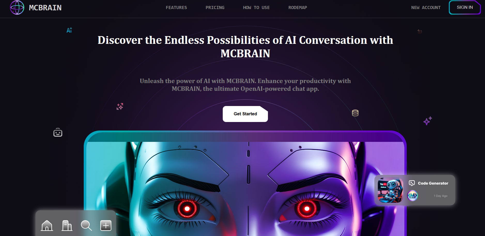

#  Build an AI Landing Page with HTML, CSS & JavaScript | Modern UI, Animations & Parallax Effects! 

## what i learnt
 ### responsive web design for all screen sizes 
 ### smooth scroll animation for a dynamic user experience 
 ### parallax effect reacting to mouse movement

## here is an over view of the first version of the project 

###
# see the project -> <a href="https://sayed-mohamed8114.github.io/MCBRAIN_aiLandingPage/" target="_blank">MCBRAIN</a>